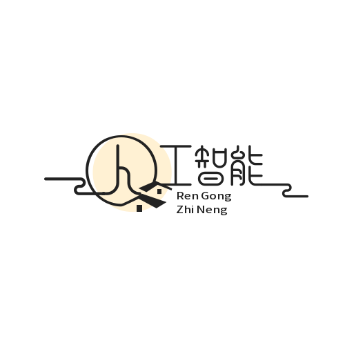

<!-- _coverpage.md -->

<!-- 背景图片 -->

    

# HT的研究生指南 

> 💪采用Docsify与Typora所设计的轻量化日常科研记录，研究方向：深度学习、图像处理、机器人、机器视觉、单片机、具身智能。

便携化办公、学习  
- ROS RVIZ GAZEBO RQT TF  
- STM32 YOLO TRANSFORM DEEPLEARNING IMAGEPROCESSING

<!-- [🍑GitHub](https://github.com/XiaoHuZi-design)  
[🍑求学之路 Let Go](/README.md) -->

    <a href="https://github.com/XiaoHuZi-design">
        <button style="width: 75px; height: 25px; font-size: 12px;">🍑GitHub</button>
    </a>
    <a href="#/README.md">  
    <!-- 加个#号，不然跳转后是文档     -->
        <button style="width: 120px; height: 25px; font-size: 12px;">🍑求学之路 Let Go</button>
    </a>

---

## 机械仔 Libra

嗨！我是一个可爱的机械仔。我喜欢音乐、星星和所有美好的事物！

<!-- 横向居中排列的点赞、收藏、音乐图标 -->

    <button class="text-red-500 hover:text-red-600 transition duration-300" id="likeBtn">
        ❤️
    </button>
    <button class="text-yellow-500 hover:text-yellow-600 transition duration-300" id="collectBtn">
        ⭐
    </button>
    <button class="text-green-500 hover:text-green-600 transition duration-300" id="musicBtn">
        🎵
    </button>

<!-- 跳转按钮 -->

    <button id="greetBtn" style="display: inline-block; background-color: #4CAF50; color: white; font-weight: bold; padding: 10px 20px; border-radius: 5px;">
        跟我打个招呼吧！
    </button>

<!-- 显示互动信息 -->

<!-- 显示点赞计数 -->

    点赞数: 0

<!-- JavaScript -->

